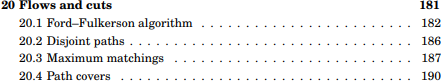
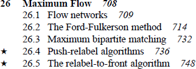

# Bipartite Matching is Fake

Maximum bipartite matching is not an independent problem, but rather a special case of a more general maximum flow problem. Moreover, all algorithms that you have ever used for maximum bipartite matching are most likely fake as well.

Don't trust me? Name one!

- Kuhn? It is nothing but Ford—Fulkerson!

- Hopcroft—Karp? It is a special case of the Dinic's algorithm for maximum flow.

- Alt—Blum—Mehlhorn—Paul? It is based on push-relabel maximum flow algorithm, but you probably know it already if you know its name in the first place 🙃

## CSES

This Finnish platform is constantly gaining popularity, and so does «Competitive Programmer's Handbook» by Antti Laaksonen, one of CSES's key figures. Upon reading it, you will discover that the only time bipartite matching is mentioned … is in the chapter about flows:

## Cormen

If you open the table of contests of a famous book «Introduction to Algorithms» by Cormen, Leiserson, Rivest, and Stein, you will find out that it suggests the same thing:

> Therefore, there must be a theoretical reduction from one problem to another.

However, one may argue that not all theoretical reductions work well in practice, so let's talk about practice.

## Codeforces

If you open Codeforces problemset, you will discover that there are 56 problems with tag `#graph-matchings`. Not that many, but enough to perform some statistical analysis. What shocks me is that 24 of them have tag `#flows`! 

> It follows that at least half of all matching problems can be solved with flow algorithms.

### Sample Problems

Not all of the aforementioned 56 problems are equally good for studying bipartite matchings. During the last week I solved some of them, and would like to present you a small subset which I find the most instructive. For every problem, its difficulty as estimated by Codeforces and its year are added.

- [_George and Interesting Graph_](https://codeforces.com/problemset/problem/387/D) (2200, 2014)

    This Div2D problem may have been difficult at that time, but it is fairly straightforward once you learn at least some bipartite matching algorithm. It is the first on my list because it does not require anything apart from bipartite matching. My solution: [387D.cpp](387D.cpp)

- [_Brevity is Soul of Wit_](https://codeforces.com/problemset/problem/120/H) (1800, 2011)

    This old but gold problem from 2011 Saratov School Regional Team Contest requires knowledge of polynomial hashing and Kuhn bipartite matching. My solution: [120H.cpp](120H.cpp)

- [_Array and Operations_](https://codeforces.com/problemset/problem/498/C) (2100, 2014)

    Despite relatively low constraints, this old Div1C/Div2E problem may still pose some difficulties for contestants who are not quite familiar with number theory or bipartite matchings. My solution: [498C.cpp](498C.cpp)

- [_Valuable Paper_](https://codeforces.com/problemset/problem/1423/B) (1900, 2020)

    This funny problem from recent 2020 Bubble Cup Finals was solved by all top teams and requires knowledge of binary search and Hopcroft—Karp bipartite matching. My solution: [1423B.cpp](1423B.cpp)

- [_Exploration plan_](https://codeforces.com/problemset/problem/852/D) (2100, 2017)

    Yet another problem from Bubble Cup Finals, but this time it was not that easy, combining all pairs shortest paths and binary search before you even get to the bipartite matching itself. <!-- My solution: [852D.cpp](852D.cpp) -->

Note: you may have noticed that these files contain the following line:
`// library code goes here`
You can get that library code from the `lib.cpp` file.
